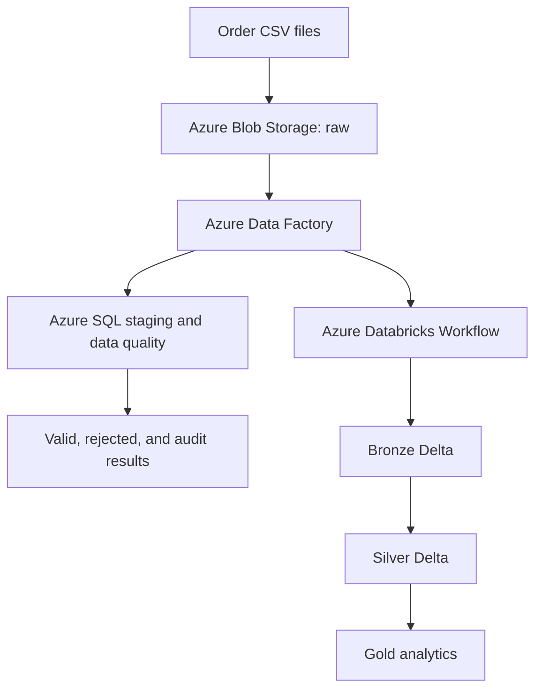

# Order Data Pipeline — Python, dbt, Azure & Databricks

An end-to-end data engineering portfolio project that processes order data
locally and in Azure. It demonstrates reliable ingestion, validation,
incremental processing, orchestration, lakehouse transformations, testing,
infrastructure as code, and CI/CD.

The project started as a transactional Python/SQLite pipeline and was extended
into an Azure MVP using Blob Storage, Azure Data Factory, Azure SQL, and an
Azure Databricks Bronze–Silver–Gold workflow.

## Architecture



The same validation and incremental-processing concepts can also run locally
with Python, SQLite, and Azurite.

## What It Demonstrates

### Reliable batch processing

- CSV extraction with schema validation
- Row-level validation and rejected-order quarantine
- Incremental processing with a persisted watermark
- Idempotent SQLite upserts
- Replay and backfill using a half-open time window
- Transaction rollback and safe reruns after failure
- Retry with exponential backoff for transient failures
- Structured logging and pipeline audit records

### Analytics engineering

- dbt staging, core, and mart models
- Seed data and reusable data tests
- Incremental and idempotent transformation patterns
- Analytics-ready Gold outputs

### Azure data engineering

- Private Blob Storage containers for raw, processed, and rejected data
- Azure Data Factory orchestration with Copy and Stored Procedure activities
- Azure SQL staging, validation, upsert, rejection, and audit procedures
- Azure Databricks Workflow with dependent Bronze, Silver, and Gold tasks
- Delta Lake transformations with Spark SQL and DataFrames
- Passwordless authentication with Microsoft Entra ID and managed identities
- Role-based access control instead of credentials stored in source code

### DevOps

- Terraform for repeatable Azure infrastructure
- Remote Terraform state
- GitHub Actions for Python, dbt, and Terraform validation
- Protected `main` branch with pull-request status checks
- Azure Data Factory Git integration, review, merge, and publish workflow

## Main Components

| Component | Purpose |
| --- | --- |
| Python + SQLite | Local ingestion, validation, replay, retry, and idempotent upserts |
| dbt | Staging and analytics transformations with automated tests |
| Azure Blob Storage | Raw, processed, and rejected file storage |
| Azure Data Factory | Batch orchestration, Azure SQL loading, and Databricks job invocation |
| Azure SQL | Staging tables, data-quality procedures, upserts, and audit logging |
| Azure Databricks | Spark/Delta Bronze–Silver–Gold lakehouse processing |
| Terraform | Infrastructure as code and environment configuration |
| GitHub Actions | Automated Python tests, dbt build, and Terraform checks |

## Verified Azure MVP

The deployed MVP uses the following orchestration flow:

1. `pl_ingest_orders_raw_to_staging` reads matching order files from Blob
   Storage.
2. ADF copies the rows into Azure SQL staging.
3. Stored procedures validate the batch, upsert valid orders, quarantine
   rejected orders, and record data-quality and pipeline audit results.
4. On the successful path, the ADF activity
   `run_databricks_lakehouse_job` invokes the Databricks job
   `order_lakehouse_incremental_job`.
5. Databricks runs the dependent tasks `bronze_incremental`,
   `silver_incremental`, and `gold_refresh` on serverless compute.

The end-to-end test completed successfully. The verified sample batch contained
13 rows: 8 valid rows and 5 rejected rows. The Databricks workflow completed
all three lakehouse tasks successfully.

## Data Quality

The pipeline separates valid and invalid data instead of silently dropping bad
records. Current checks include:

- required `customer_id`
- allowed order status
- valid numeric amount
- valid `updated_at` timestamp
- duplicate `order_id` detection

Rejected records retain an error reason so that they can be investigated or
reprocessed later.

## Project Structure

Key local components include:

```text
order-data-pipeline/
├── pipeline.py
├── blob_storage.py
├── test_pipeline.py
├── requirements.txt
├── README.md
├── CONTRIBUTING.md
├── data/
│   ├── orders_2026-08-01.csv
│   └── orders_2026-08-02.csv
└── order_analytics/
    ├── dbt_project.yml
    ├── models/
    └── seeds/
```

The repository also versions Terraform, GitHub Actions, and Azure Data Factory
artifacts used by the cloud implementation.

The SQLite database is generated at `data/order_pipeline.db` when the local
pipeline runs. Database files are intentionally excluded from Git.

## Quick Start

```bash
git clone https://github.com/HoaHBRS/order-data-pipeline.git
cd order-data-pipeline

python3 -m venv .venv
source .venv/bin/activate
python3 -m pip install -r requirements.txt

python3 test_pipeline.py
```

## Run the Local Incremental Pipeline

```bash
python3 pipeline.py incremental
```

Run the same command again to verify idempotency: previously handled rows must
not create duplicate SQLite updates or duplicate quarantine records.

## Run a Replay

```bash
python3 pipeline.py replay \
  --source "blob://raw/orders_2026-08-02.csv" \
  --start-at "2026-08-02T09:00:00" \
  --end-at "2026-08-02T09:11:00"
```

Replay uses a half-open interval:

```text
start_at <= updated_at < end_at
```

## Azure Blob Storage

The pipeline supports local CSV files, Azurite, and real Azure Blob Storage.
The Azure Storage account uses three private containers:

- `raw`: incoming source files
- `processed`: rows that passed validation
- `rejected`: invalid rows with an `error_message`

For passwordless local development, sign in with Azure CLI and set the
non-secret Storage account URL:

```bash
az login

export AZURE_STORAGE_ACCOUNT_URL="https://YOUR_STORAGE_ACCOUNT.blob.core.windows.net"
```

The signed-in identity requires the `Storage Blob Data Contributor` role.

Run an incremental pipeline from Azure Blob Storage:

```bash
python3 pipeline.py incremental \
  --source "blob://raw/orders_2026-08-02.csv"
```

## Run the Tests

Python tests:

```bash
python3 test_pipeline.py
```

The eight tests cover incremental and replay idempotency, replay boundaries,
invalid windows, rollback, safe reruns, and transient-error retry.

dbt build:

```bash
cd order_analytics
dbt seed
dbt build
```

The verified dbt build completes 11 checks successfully.

## CI/CD

Pull requests to `main` run three required checks:

- Python tests
- dbt build and tests
- Terraform formatting and validation

Azure Data Factory changes are developed on a feature branch, reviewed through
a pull request, merged after the checks pass, and then published from ADF.
Direct writes to the protected `main` branch are intentionally blocked.

## Security and Cost Controls

- No access tokens or passwords are committed to the repository.
- Local Azure access uses `DefaultAzureCredential`.
- ADF invokes Databricks through its system-assigned managed identity.
- Azure RBAC grants only the access required by each workload.
- Private storage containers are used for pipeline data.
- A monthly Azure budget and spending protection are configured.
- Cloud resources can be stopped or removed after validation to avoid idle
  charges.

## Additional Cloud Experiments

The same Azure workspace was also used to explore:

- Event Hubs ingestion with a Databricks Structured Streaming consumer
- offsets, partitions, checkpoints, and available-now processing
- Synapse serverless SQL queries over lake data

These experiments complement the batch MVP and provide a path toward a future
streaming version of the pipeline.

## Current Status

- Eight automated Python tests passing
- dbt build verified with 11 successful checks
- Local Blob Storage workflow verified with Azurite
- Real Azure Blob Storage workflow verified in Germany West Central
- ADF and Azure SQL ingestion/data-quality flow verified
- ADF-to-Databricks managed-identity connection verified
- Bronze–Silver–Gold Databricks workflow verified end to end
- GitHub pull-request checks passing
- ADF changes merged and published successfully

## Possible Next Improvements

- Pass the triggering file path dynamically from ADF to the Databricks job
- Move the final success audit event after the Databricks activity
- Add automated end-to-end tests for the cloud workflow
- Add monitoring dashboards and operational alerts
- Package the streaming experiment as a repeatable deployment
