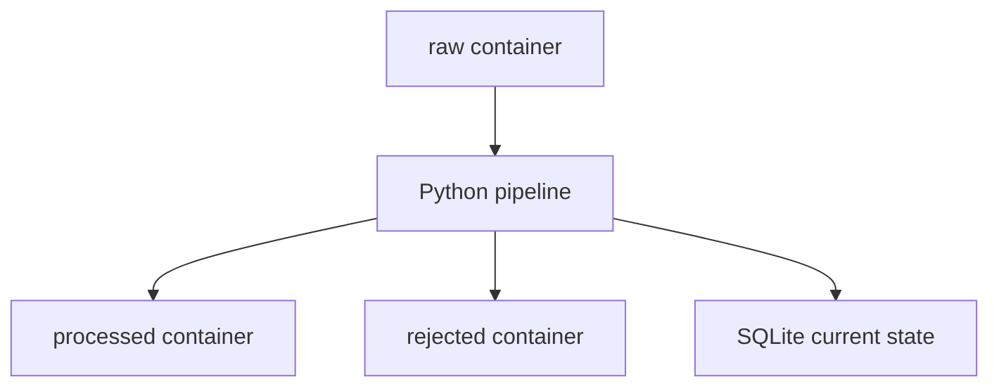

# Order Pipeline Mini Project

A small Python and SQLite data pipeline for processing order data safely and
repeatably.

## What It Demonstrates

- CSV extraction with schema validation
- Row-level validation and rejected-order quarantine
- Incremental processing with a persisted watermark
- Idempotent SQLite upserts
- Replay and backfill using a half-open time window
- Transaction rollback and safe reruns after failure
- Pipeline audit records for successful and failed runs
- Retry with exponential backoff for transient incremental failures
- Command-line interface and structured logging
- Automated tests using isolated in-memory databases
- Azure Blob Storage integration using `raw`, `processed`, and `rejected` containers
- Dual local/cloud operation with Azurite and real Azure Storage
- Passwordless Azure authentication using `DefaultAzureCredential`
- Cost monitoring with a monthly Azure budget and spending protection

## Project Structure

```text
order-data-pipeline/
├── pipeline.py
├── blob_storage.py
├── test_pipeline.py
├── requirements.txt
├── README.md
├── CONTRIBUTING.md
├── .gitignore
├── data/
│   ├── orders_2026-08-01.csv
│   └── orders_2026-08-02.csv
└── order_analytics/
    ├── dbt_project.yml
    ├── models/
    └── seeds/
```

The SQLite database is generated at `data/order_pipeline.db` when the pipeline
runs. Database files are intentionally excluded from Git.

## Quick Start

```bash
git clone https://github.com/HoaHBRS/order-data-pipeline.git
cd order-data-pipeline

python3 -m venv .venv
source .venv/bin/activate
python3 -m pip install -r requirements.txt

python3 test_pipeline.py
```

## Azure Blob Storage

The pipeline supports local CSV files, Azurite, and real Azure Blob Storage.

The Azure Storage account uses three private containers:

- `raw`: incoming source files
- `processed`: rows that passed validation
- `rejected`: invalid rows with an `error_message`

For passwordless access, sign in with Azure CLI and set the non-secret
Storage account URL:

```bash
az login

export AZURE_STORAGE_ACCOUNT_URL="https://YOUR_STORAGE_ACCOUNT.blob.core.windows.net"
```

The signed-in identity requires the `Storage Blob Data Contributor` role.

Run an incremental pipeline from Azure Blob Storage:

```bash
python3 pipeline.py incremental \
  --source "blob://raw/orders_2026-08-02.csv"
```

## Pipeline Flow



For Blob Storage sources, valid rows are written to `processed`. Invalid rows
are written to `rejected` with an error message. Only newer valid records
update the current state in SQLite.

## Run the Incremental Pipeline

```bash
python3 pipeline.py incremental
```

Run the same command again to verify idempotency: previously handled rows
must not create duplicate SQLite updates or duplicate quarantine records.

## Run a Replay

```bash
python3 pipeline.py replay \
  --source "blob://raw/orders_2026-08-02.csv" \
  --start-at "2026-08-02T09:00:00" \
  --end-at "2026-08-02T09:11:00"
```

Replay uses a half-open interval:

```text
start_at <= updated_at < end_at
```

## Run the Tests

```bash
python3 test_pipeline.py
```

The eight tests cover incremental and replay idempotency, replay boundaries,
invalid windows, rollback, safe reruns, and transient-error retry.

## Requirements

- Python 3 with SQLite support
- Python packages listed in `requirements.txt`
- Azure CLI for passwordless access to real Azure Storage
- Azurite (optional) for local Blob Storage emulation

## Project Status

- Eight automated Python tests passing
- dbt build verified with 11 successful checks
- Local Blob Storage workflow verified with Azurite
- Real Azure Blob Storage workflow verified in Germany West Central
- Passwordless authentication verified with Azure CLI and Microsoft Entra ID
- Incremental processing and replay verified as idempotent
